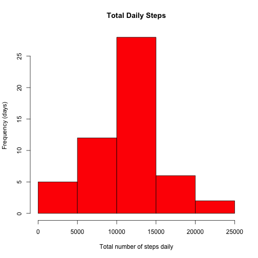

## Loading and preprocessing the data

```r
library(plyr)
library(lattice)
dataDir <- "./data"
dataPath <- "./data/activity.csv"
if(!file.exists(dataPath)) {
  # create the data directory if necessary
  dir.create(dataDir)
  unzip("activity.zip", exdir = dataDir)
}
data <- read.csv(dataPath, na.strings = "NA")
data$date1 <- strptime(data$date, format = "%Y-%m-%d")
# simple function to format numbers when rendering them in the report text
fmt <- function(num) {
  prettyNum(num, big.mark = ",")
}
```


## What is mean total number of steps taken per day?

```r
stepsPerDay <- aggregate(steps ~ date, data = data, FUN = "sum")
medStepsPerDay <- median(stepsPerDay$steps)
meanStepsPerDay <- mean(stepsPerDay$steps)
hist(x = stepsPerDay$steps,
     main = "Total Daily Steps",
     xlab = "Total number of steps daily",
     ylab = "Frequency (days)",
     col = "red")
```

 

The median steps taken per day is **10,765** while the mean steps per day is **10,766**.

## What is the average daily activity pattern?

```r
averageDailyActivity <- aggregate(steps ~ interval, data = data[!is.na(data$steps),], FUN = "mean")
maxInterval <- averageDailyActivity[averageDailyActivity$steps == max(averageDailyActivity$steps),]$interval
plot(
  averageDailyActivity$interval,
  averageDailyActivity$steps,
  type = "l",
  main = "Mean Daily Activity",
  ylab = "Mean Steps",
  xlab = "Interval (5 minutes)"
)
```

 

The most active 5-minute interval was **835**.

## Imputing missing values

```r
naCount <- nrow(data[is.na(data$steps) == TRUE,])
# left join the loaded data with the mean daily data
naFixed <- merge(x = data, y = averageDailyActivity, by = "interval", all.x = TRUE)
# create a new column that contains the current value or the mean value if NA
naFixed <- mutate(naFixed, fixed = ifelse(is.na(steps.x), round(steps.y), steps.x))

fixedStepsPerDay <- aggregate(fixed ~ date, data = naFixed, FUN = "sum")
fixedMedStepsPerDay <- median(fixedStepsPerDay$fixed)
fixedMeanStepsPerDay <- mean(fixedStepsPerDay$fixed)
hist(x = fixedStepsPerDay$fixed,
     main = "Total Daily Steps (NA's Imputed)",
     xlab = "Total number of steps daily",
     ylab = "Frequency (days)",
     col = "red")
```

 

In the original data set a total of **2,304** values were reported as NA, these have been replaced with the average activity for that interval as calculated previously.

The median steps taken per day with NA's replaced is **10,762** while the mean steps per day is **10,766**.  This is not significantly different than the values prior to the imputing of the missing values.


## Are there differences in activity patterns between weekdays and weekends?

```r
naFixed$day <- ifelse(weekdays(naFixed$date1) %in% c("Saturday", "Sunday"), "weekend", "weekday")
naFixed$day <- as.factor(naFixed$day)

naFixed2 <- aggregate(cbind(fixed) ~
      interval + day,
      mean,
      data = naFixed)

xyplot(fixed ~ interval | day,
  data = naFixed2,
  type = "l",
  xlab = "Interval",
  ylab = "Number of steps",
  layout = c(1,2))
```

 

The plots above indicate that people are most active earlier in the day during the week, on weekends people wake later and their activity is spread more evenly though out the day.
